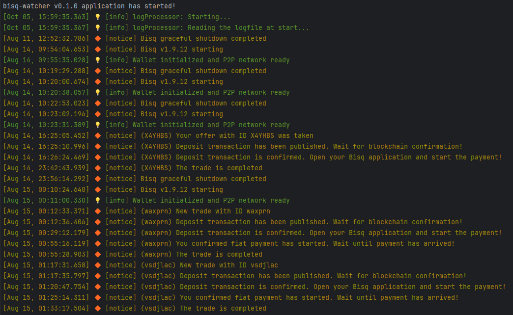

# Overview

**Bisq-watcher** is a customizable monitoring tool for the Bisq application, built with Node.js and compatible with Windows, Linux, and macOS. It allows you to set up a watcher to monitor your Bisq application on your computer.

Bisq-watcher consists of three core components:

*  **File Watcher**: Monitors the main bisq log file `bisq.log`.
*  **Log Processor**: Parses and extracts relevant log data based on predefined rules.
*  **Logger**: Sends notifications via multiple transports, including **console**, **file**, and **Telegram**.


Whether you need real-time trade updates on Telegram or just want to keep an eye on the logs, bisq-watcher has you covered.

Screenshot example of console output:




# Table of Contents

- [Installation](#installation)
    - [Prerequisites](#prerequisites)
    - [Node.js](#nodejs)
    - [Repository Cloning](#repository-cloning)
- [Configuration](#configuration)
    - [App Configuration](#app-configuration)
    - [Telegram Integration](#telegram-integration)
- [Usage](#usage)
    - [Starting the Application](#starting-the-application)
    - [Notification Testing](#notification-testing)
    - [Running the application using PM2](#running-the-application-using-pm2)
    - [Setting Up Multiple Watchers](#setting-up-multiple-watchers)
- [Contributions](#contributions)
- [Versioning and Changelog](#versioning-and-changelog)


# Installation

## Prerequisites

Ensure that Bisq-watcher runs on the same computer as your Bisq application.
You'll need [Node.js](https://nodejs.org/en) installed.


## Node.js

* Download and install Node.js from the [official website](https://nodejs.org/en).


## Repository Cloning

* Before cloning the repository, make sure Git is installed on your system. If not, download and install it from the [official Git website](https://git-scm.com/).

* Clone bisq-watcher repository:

```shell
git clone https://github.com/dutu/bisq-watcher
cd bisq-watcher
```

* Checkout the latest release:
```shell
git checkout v0.1.0
```

* Install dependencies:
```shell
npm install
```

# Configuration

## App Configuration

* Make a copy of the `bisq-watcher.config.sample.mjs` file and rename it to `bisq-watcher.config.mjs`.

* Edit `bisq-watcher.config.mjs` to customize your watcher settings, including console logging, file logging, and Telegram integration.
  
    > In particular, make sure: `logFile` specifies the correct location of the main Bisq log file `bisq.log`. See [Bisq data directory](https://bisq.wiki/Data_directory) default locations.

For advanced configurations and all available options, refer to the JSDoc comments within [`app.config.sample.mjs`](./app.config.sample.mjs) file.


## Telegram Integration

To enable Telegram-based log notifications:

### Getting API Token

* Open Telegram and search for the "BotFather" bot.

* Start a chat and use the `/newbot` command to create a new bot.

* Follow BotFather's prompts to name your bot.

* After creating the bot, you'll receive an API token. Note this token for use in `bisq-watcher.config.mjs`.


### Getting Chat ID

* Add your new bot to a Telegram chat or group.

* Send a test message in the chat.

* Replace `YOUR_API_TOKEN` in the following URL and open it in a web browser:

 https://api.telegram.org/botYOUR_API_TOKEN/getUpdates

* Look for the `chat` object in the returned JSON, your chat ID will be the value of `id` within that object.


### Update `bisq-watcher.config.mjs`

* Update `bisq-watcher.config.mjs` with the Telegram bot configuration:

```js
{
  ...,
  loggerConfig: [
    ...,
    {
      type: 'telegram',
      apiToken: 'YOUR_API_TOKEN',
      chatId: 'YOUR_CHAT_ID',
      enabled: true,
      sendToTelegram: true
    }
  ]
}
```

Replace `YOUR_API_TOKEN` and `YOUR_CHAT_ID` with the actual values you obtained earlier.


# Usage

## Starting the Application

* To run the bisq-watcher, use:

```shell
npm start bisq-watcher
```

## Notification Testing

By default, bisq-watcher monitors new events added to the main Bisq logfile, `bisq.log`. However, for testing purposes, you can enable a debug flag called `atStartProcessEntireLogFile`.

Setting `atStartProcessEntireLogFile` to `true` in the configuration file `bisq-watcher.config.mjs` will instruct bisq-watcher to process the entire `bisq.log` file. Notifications will be sent as the logfile is read and parsed.

This feature is useful for testing and validating notifications without waiting for new events to occur in real-time.


## Running the application using PM2

PM2 is a daemon process manager that helps keep your application running 24/7. PM2 can be used and configured to restart your application after unexpected machine restarts. Bisq-watcher is designed to work seamlessly with PM2.

* Install PM2 globally:

```shell
npm install -g pm2
```


* Use PM2 to start the application:

```shell
pm2 start bisq-watcher
```


* View console output:
```shell
pm2 logs bisq-watcher
```

* To stop the application:
```shell
pm2 stop bisq-watcher
```

## Setting Up Multiple Watchers

If you need to monitor two Bisq instances on the same computer, follow these steps:

* Create a second copy of `bisq-watcher.config.sample.mjs` and give it a different name, e.g. `bisq-watcher2.config.mjs`


* Edit `bisq-watcher2.config.mjs` to configure the second watcher.

  
* Start the second watcher:

```shell
CONFIG_NAME=bisq-watcher2 npm start
```

 
* To start the second watcher with PM2:

```shell
pm2 start bisq-watcher2
```

# Contributions

Bisq-watcher is an actively developed, and contributions are welcome.

While the application is still in its early stages, it currently includes rules for trading and dispute notifications.
We are continuously working on expanding the set of rules to enhance the monitoring capabilities.

If you would like to contribute by adding more rules to enable additional notifications, please consider opening an issue or submitting a pull request. You can find the rule definitions in the [server/rules](./server/rules) folder.


# Versioning and Changelog

This project adheres to [Semantic Versioning](https://semver.org/). 

For the versions available and changes made in each version, see the [Releases](https://github.com/dutu/bisq-watcher/releases) on this repository.
